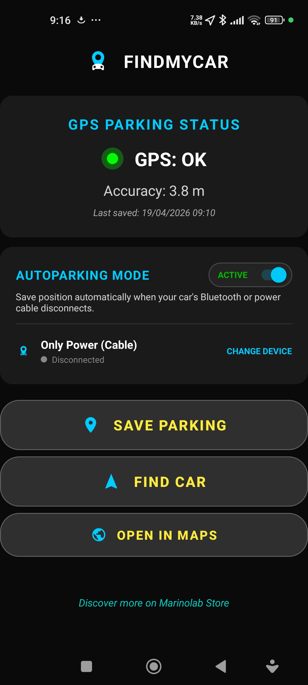
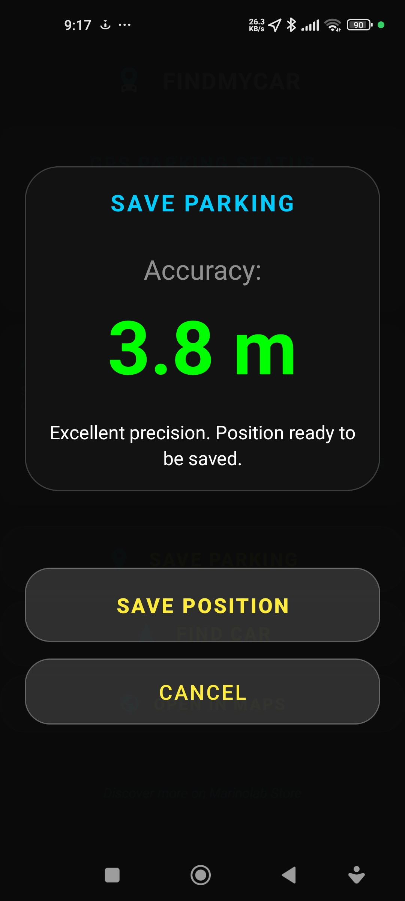
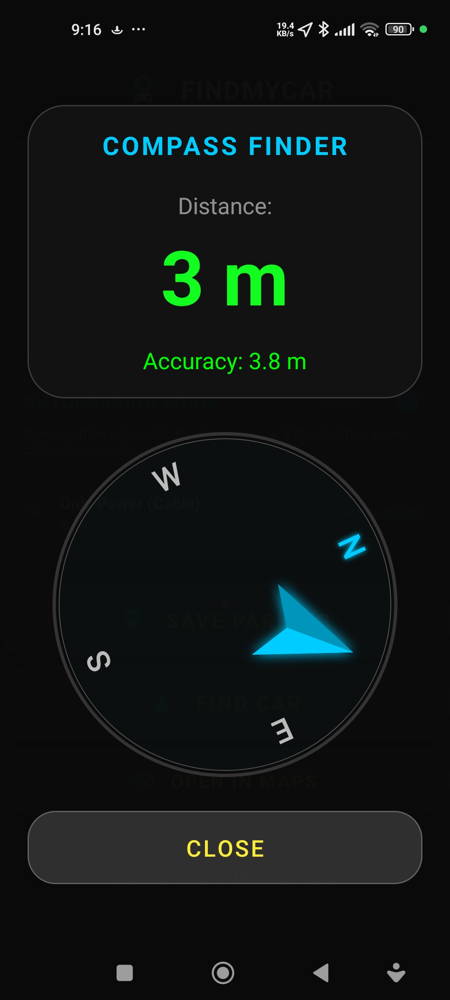
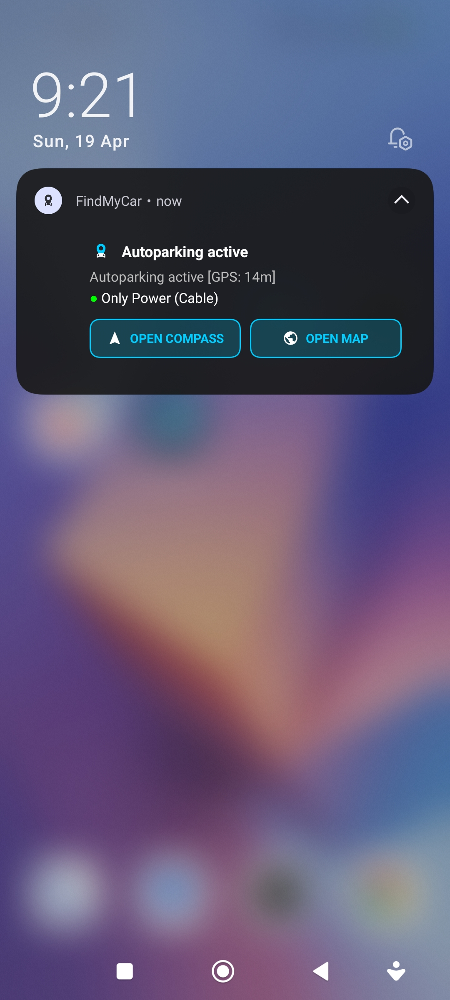

# 🚗 Find My Car

**Non dimenticherai mai più dove hai parcheggiato.**

Find My Car è un'app Android premium che salva automaticamente la posizione del tuo veicolo e ti guida a ritrovarlo con precisione — ovunque tu l'abbia lasciato.

---

## ✨ Come funziona

Parcheggia. Scendi dalla macchina. Fine.

Find My Car rileva quando ti disconnetti dal Bluetooth dell'auto o scolleghi il cavo di ricarica, e salva istantaneamente la tua posizione GPS esatta. Quando hai bisogno di ritrovare la macchina, apri l'app — una bussola 3D in tempo reale ti punta dritta verso di essa.

Non devi ricordarti di aprire l'app. Non devi premere nulla. Funziona e basta.

---

## 🎬 Video

  

---

## 📱 Screenshot

  
  
  
  

---

## 🔑 Funzionalità

**Autoparking** *(acquisto in-app)*
Salva automaticamente la posizione di parcheggio quando il Bluetooth dell'auto si disconnette o il cavo di alimentazione viene scollegato. Un ritardo intelligente di 10 secondi con controllo della velocità previene i falsi positivi — nessun salvataggio accidentale mentre guidi.

**GPS ad Alta Precisione**
Un algoritmo di posizionamento intelligente cerca il miglior segnale GPS per un massimo di 10 secondi, garantendo una precisione inferiore ai 10 metri. Quando il telefono è in carica, il GPS rimane attivo con aggiornamenti ogni 5 secondi per un salvataggio istantaneo e millimetrico.

**Bussola 3D**
Una bussola premium con bezel fisico e puntatore in tempo reale che ti guida a piedi direttamente verso il veicolo, con visualizzazione della distanza live.

**Notifiche Interattive**
Una notifica di stato persistente mostra la precisione GPS in tempo reale, lo stato della connessione Bluetooth e tasti rapidi per aprire la bussola o le mappe — senza nemmeno sbloccare il telefono.

**Compatibile con qualsiasi veicolo**
Nessun Bluetooth in auto? Nessun problema. La modalità solo cavo funziona con qualsiasi veicolo, con o senza Bluetooth di bordo.

**Ottimizzazione Xiaomi / MIUI**
Gestione specifica per le policy aggressive di risparmio energetico sui dispositivi Xiaomi, così il servizio funziona sempre in modo affidabile in background.

---

## 🛠️ Dettagli tecnici

| | |
|---|---|
| Linguaggio | Java (Android nativo) |
| Min SDK | Android 10 (API 29) |
| Target SDK | Android 14+ |
| Sensori | GPS, Accelerometro, Magnetometro |
| Background | Foreground Services (`location`, `connectedDevice`) |
| UI | Custom views, design Glassmorphism |

---

## 📥 Download

Find My Car è disponibile gratuitamente su Google Play. L'Autoparking è disponibile come acquisto in-app una tantum.

---

*Sviluppato con passione da [Marinolab](https://github.com/marinolabtech) · Italia 🇮🇹*
